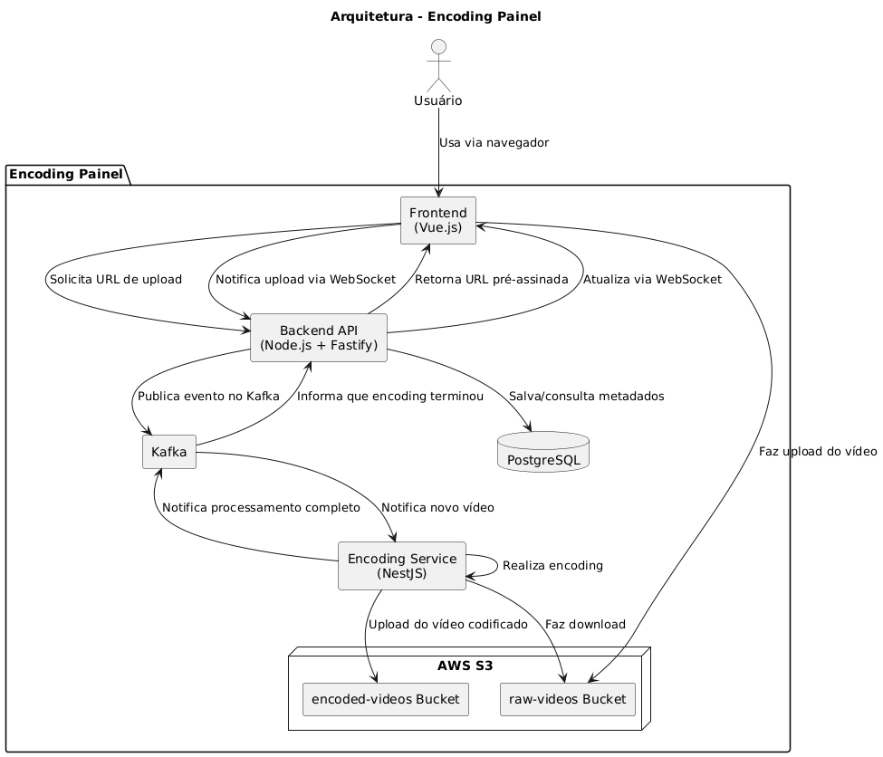

# 🎬 Encoding Painel [ Em Desenvolvimento ]

Sistema para encoding de vídeos via painel web, com upload em S3, processamento assíncrono via Kafka e atualização em tempo real.

## 🧩 Arquitetura Geral

O projeto Encoding Painel é composto por:

- **Frontend**: Vue.js/Nuxt.js - Interface do usuário
- **Backend**: Node.js + Fastify - Gerencia uploads e comunicação
- **Encoding Service**: NestJS - Processa os vídeos (encoding)
- **Banco de Dados**: PostgreSQL - Armazena informações dos vídeos
- **Mensageria**: Apache Kafka - Comunicação entre serviços
- **Armazenamento**: AWS S3 - Dois buckets:
  - `raw-videos`: Vídeos não processados
  - `encoded-videos`: Vídeos após encode

## 🔁 Fluxo de Funcionamento

### Upload Inicial
1. Usuário faz upload do vídeo no frontend
2. Frontend solicita ao backend um link pré-assinado do S3 para upload
3. Backend gera URL e retorna para o frontend
4. Frontend envia o vídeo diretamente para o bucket raw-videos

### Notificação de Upload Concluído
1. Após o upload, frontend notifica o backend via WebSocket
2. Backend publica uma mensagem no Kafka contendo o link do vídeo no S3

### Processamento do Vídeo
1. O serviço encoding-service consome a mensagem do Kafka
2. Baixa o vídeo do bucket raw-videos
3. Realiza o encoding (ex: conversão para MP4, H.264, etc)
4. Faz upload do vídeo codificado no bucket encoded-videos

### Finalização do Processo
1. Serviço encoding-service publica no Kafka que o processo foi concluído
2. Backend recebe essa informação e atualiza o banco de dados
3. Envia notificação via WebSocket ao frontend
4. Frontend atualiza a lista de vídeos disponíveis

OBS: Atualmente o projeto esta na etapa de Processamento de Vídeo

## 📦 Estrutura do Projeto

\`\`\`
encoding-painel/
├── backend/               # API Fastify
├── encoding-service/      # Serviço NestJS de encoding
├── frontend/             # Painel Vue.js/Nuxt.js
├── docker-compose.yml
└── README.md
\`\`\`

## 🚀 Como Executar

### Pré-requisitos

- Docker e Docker Compose
- Node.js 20.x
- PostgreSQL
- Apache Kafka

### Configuração

1. Clone o repositório:
\`\`\`bash
git clone [url-do-repositorio]
cd encoding-painel
\`\`\`

2. Configure as variáveis de ambiente:
- Crie arquivos `.env` em cada diretório (frontend, backend, encoding-service)
- Configure as credenciais da AWS e demais variáveis necessárias

### Execução

#### Com Docker (Recomendado)

1. Inicie todos os serviços:
\`\`\`bash
docker-compose up -d
\`\`\`

2. Acesse:
- Frontend: http://localhost:3000
- Backend: http://localhost:3001
- Encoding Service: http://localhost:3002

#### Desenvolvimento Local

1. Backend:
\`\`\`bash
cd backend
npm install
npm run start
\`\`\`

2. Encoding Service:
\`\`\`bash
cd encoding-service
npm install
npm run start
\`\`\`

3. Frontend:
\`\`\`bash
cd frontend
npm install
npm run dev
\`\`\`

## 🛠️ Tecnologias Utilizadas

### Frontend
- Vue.js/Nuxt.js
- Socket.IO Client
- TailwindCSS

### Backend
- Node.js
- Fastify
- Sequelize
- Socket.IO
- AWS SDK

### Encoding Service
- NestJS
- KafkaJS

### Infraestrutura
- PostgreSQL
- Apache Kafka
- AWS S3
- Docker
- Docker Compose

